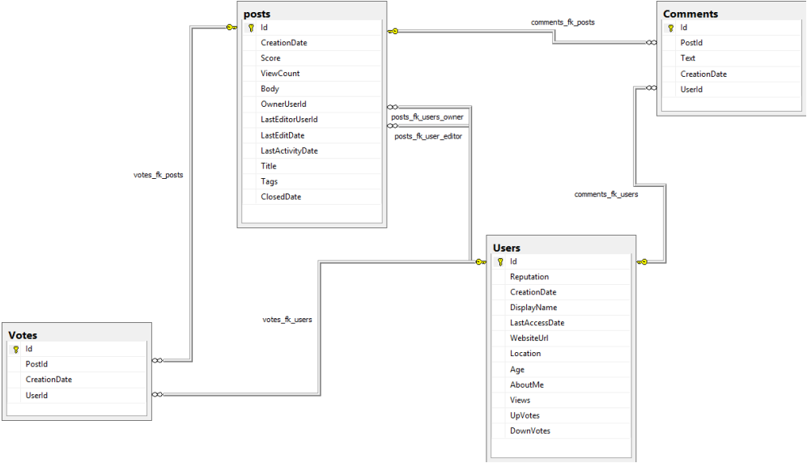
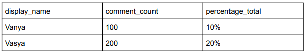
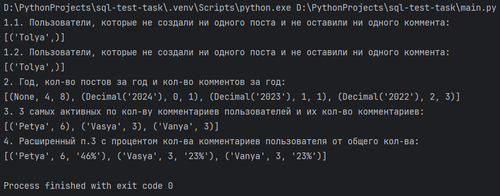

## Задание

Упрощенная бд для Stack Exchange.

● Посты (posts) - у каждого поста могут быть разные комментарии, за каждый
пост могут голосовать разные пользователи (чтобы улучшить его рейтинг).

● Голоса (vote) - Каждый голос состоит из идентификатора голоса, номера
пользователя (FK), номера сообщения (FK) и даты создания.

● Комментарии (comments) - Подробная информация о комментариях к
различным постам.

● Пользователи (users) - сведения о пользователях, которые прокомментировали
пост / написали пост / проголосовали за пост.

1. Написать запрос для вывода пользователей, которые не создали ни одного
поста и не оставили ни одного коммента. (несколько вариантов запроса)
2. Написать запрос для вывода года, кол-ва постов за год и кол-во комментов за
год.
3. Вывести 3 самых активных (по кол-ву комментариев) пользователей (display
name) и их кол-во комментариев
4. Расширить п.3, добавив процент кол-ва комментариев пользователя от общего
кол-ва

Пример:

## Установка
    git clone https://github.com/Tokiwokoe/sql-test-task.git

## Настройка виртуального окружения
    python -m venv venv
    \venv\Scripts\activate
    pip install -r requirements.txt

## Настройка переменных окружения
Необходимо скопировать данные с файла .env.template в файл .env и заполнить его своими значениями

    cp .env.template .env

## Запуск
    python main.py

## Результат

